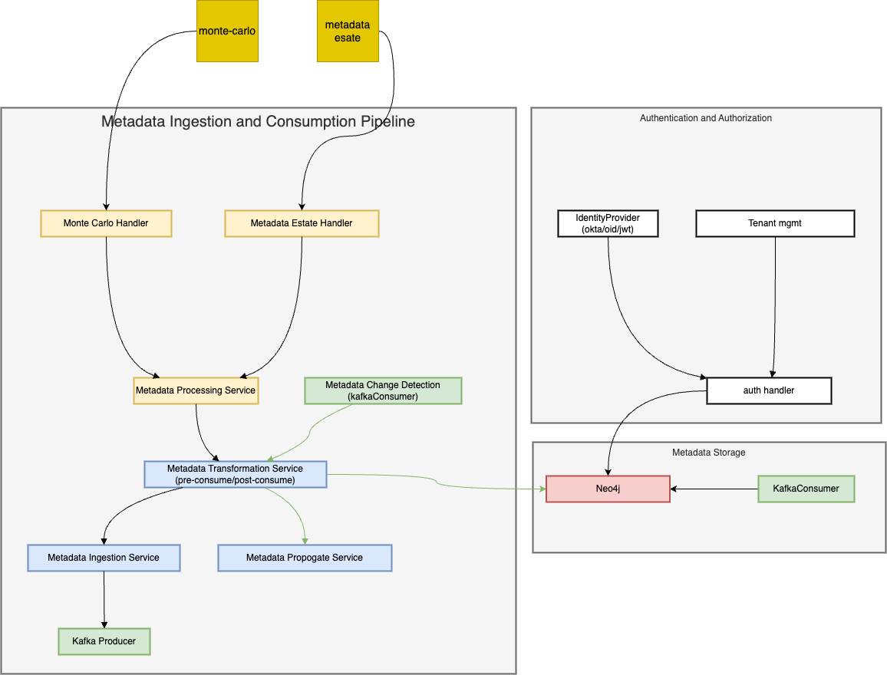

**High-Level Design:**

1. **Metadata Ingestion and Consumption Pipeline**:
   - **Inbound Metadata Ingestion**:
     - Metadata is ingested from external sources like MonteCarlo and internal sources like metadata estates using dedicated handlers.
     - The Metadata Transformation Service applies any required transformations/enrichments to the metadata (e.g., 80-20 rule for columns).
     - The Metadata Ingestion Service publishes the transformed metadata events to a Kafka topic.
   - **Outbound Metadata Consumption**:
     - The Metadata Change Detection component, a kafka consumer, monitors the Kafka topic for any metadata changes.
     - The Metadata Transformation Service applies any required post-consume transformations and enrichments like lineage updates, PII/GDPR annotations
     - The Metadata Consumption Service then propagates the updated metadata to external and internal consumers.

2. **Metadata Storage**:
   - A Kafka consumer reads the metadata events from the Kafka topic and stores them in the Graph DB.

3. **Authentication and Authorization**:
   - The Identity Provider handles user auth.
   - Auth handler enforces fine-grained, tenant-level access control policies, interacting with the Metadata Store(graph db).
   - The Tenant mgmt manages tenant for multi-tenancy.

4. **Deployment**:
   - The solution is deployed using container orchestration (e.g., Kubernetes) to enable horizontal scaling of individual components (e.g., ingestion, consumption, transformation) based on load.

5. **Observability and Monitoring**:
    - Prometheus for collecting metrics.
    - Grafana for visualization.

**Low-Level Design:**

1. **Metadata Ingestion and Consumption Pipeline**:
   - **Inbound Metadata Ingestion**:
     - Metadata Processing Service: Responsible for extracting metadata from various sources (e.g., Monte Carlo, internal metadata estate).
     - Metadata Transformation Service: Applies pre-ingest transformations and enrichments (e.g., 80-20 rule for columns).
     - Metadata Ingestion Service: Publishes the transformed metadata events to a Kafka topic.
   - **Outbound Metadata Consumption**:
     - Metadata Change Detection: Monitors the Kafka topic for metadata changes and triggers downstream updates
     - Metadata Transformation Engine: Applies post-consume transformations and enrichments like lineage updates, PII/GDPR annotating.
     - Metadata Propagate Service: Responsible for propagating metadata changes to external and internal consumers.

2. **Metadata Storage and Indexing**:
   - Kafka Consumer: Reads the metadata events from the Kafka topic and stores them in the Neo4j Metadata Store.
   - Neo4j Metadata Store: A scalable and performant graph database used to store and index the metadata.

3. **Authentication and Authorization**:
   - Identity Provider: Handles user authentication (e.g., SSO, OIDC).
   - Access Control Engine: Enforces fine-grained, tenant-level access control policies, interacting with the Neo4j Metadata Store.
   - Tenant Management Service: Manages tenant-specific configurations and settings.

## Design Diagram

